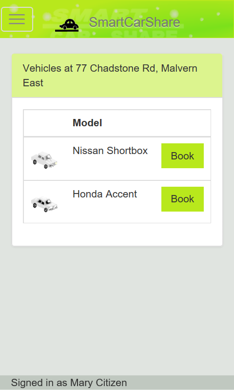

# SmartCarShare Mobile App
A cross-platform app for the fictional car-hire business, SmartCarShare.

Built using Cordova, for Android, iOS or Windows Phone.

## About
The SmartCarShare business is a fictional service allowing its members to book vehicles for a short period of time. It is ideal for people who need to use a car sometimes, but do not wish to own one.

The app is reliant on the RESTful web service, also available on my GitHub. The URL to the service, once it is installed, must be noted in the application's source code so that it can be reached. The service provides access to the data source that the app relies on.

## Installation Instructions
You will require Visual Studio installed on your computer, including the component for Mobile Development with JavaScript.
* Clone this repository
* Open the Visual Studio Solution file in the root directory
* Open the file 'apiurl.js', located in the 'www/js/' directory, and set the 'rootURL' variable to the URL for the web service
* Build the solution for Android, iOS or Windows and deploy to a device or an emulator
